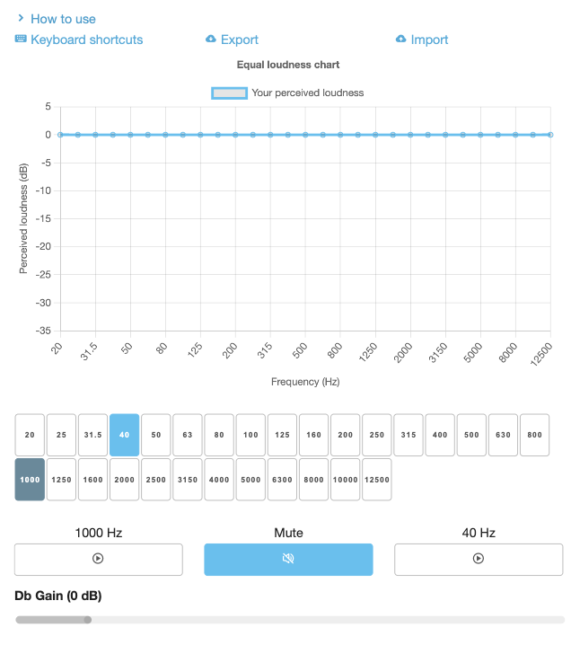

# Loudness Equalizer

Purpose of this tool is to observe how you perceive loudness of each frequency.

### How to use?
- Select one of the frequencies you'd like to listen to on frequency tiles.
- Click **▶️** button below 1000 Hz frequency and listen to its loudness
- Select **▶️** below your chosen frequency and adjust Db Gain so that it matches loudness of 1000 Hz sound.
- Do that for each frequency

### Chart
Chart shows your perceived dB level for each frequency. Value shown there means how many dBs you need to add to the frequency in order for it to be heard equally to 1000 Hz frequency.

### Shortcuts
- Q - Previous frequency  
- E - Next frequency  
- A - Play 1000 Hz sound  
- S - Mute / unmute  
- D - Play selected frequency  
- Left - Decrease dB Gain  
- Right - Increase dB Gain  

### Exporting
Click **Export** button and save exported `JSON` file on your drive.

### Importing
Click **Import button**. Modal will load, click **Choose file** and pick the `JSON` file you'd like to import. Click Import button. This does imports file only locally and loads it onto the chart.

### Warning
Baseline dB gain is set to -35 dB, so be careful with your audio volume!

### Dependencies
- [Skeleton framework](https://github.com/skeleton-framework/skeleton-framework)
  - [MIT LICENSE](https://github.com/skeleton-framework/skeleton-framework/blob/master/LICENSE)
- [Chart.js](https://github.com/chartjs/Chart.js)
  - [MIT LICENSE](https://github.com/chartjs/Chart.js/blob/master/LICENSE.md)
- [Tone.js](https://github.com/Tonejs/Tone.js)
  - [MIT LICENSE](https://github.com/Tonejs/Tone.js/blob/dev/LICENSE.md)
- [Boxicons](https://github.com/atisawd/boxicons)
  - [MIT LICENSE](https://github.com/atisawd/boxicons/blob/master/LICENSE)